# Placement Prediction and Skill Gap Analysis System

An end-to-end Machine Learning and Data Science system that evaluates student placement readiness, estimates expected salary packages, benchmarks individual competencies against industry role profiles, generates prioritized improvement recommendations with measured gains, and provides interactive what-if simulations through a Streamlit web application.

---

## Key Features

- Placement Probability: Predicts likelihood of campus placement using calibrated classification models.
- Salary Package Range: Estimates conditional salary package (LPA) with a 15% confidence interval for placed candidates.
- Holistic Readiness Score: Combines statistical placement probability with engineered domain sub-scores (0-100 scale).
- Risk Level Categorization: Classifies placement risk into LOW, MEDIUM, or HIGH tiers with color-coded alerts.
- Skill Gap Analysis: Benchmarks 7 core technical and soft skills against target role profiles (Software Developer, Data Analyst, Data Scientist).
- Prioritized Recommendations: Delivers actionable improvement steps ordered by priority and quantified placement probability gains.
- Interactive What-If Simulation: Live experimentation tool enabling candidates to test skill and profile adjustments and observe immediate metric shifts.
- Cross-Role Comparison: Ranks alignment across all defined career tracks to reveal best-fit opportunities.
- Institutional Insights: Cohort-level distributions, placement rates across internships/CGPA bands, model leaderboards, and feature importance rankings.
- Exportable Dossiers: Direct downloads of beautifully styled HTML evaluation reports (with print-to-PDF support), structured multi-section CSV reports, Markdown dossiers, and single-row CSV summaries.

---

## System Architecture

```text
+-----------------------------------------------------------------------------------+
|                                     DATA PIPELINE                                 |
|                                                                                   |
|  [data_generator.py]  --->  data/raw/placement_data.csv (2,500 records)          |
|                                   |                                               |
|  [preprocessing.py]   --->  data/processed/clean_data.csv                         |
|                             data/processed/train.csv & test.csv (80/20 split)     |
+-----------------------------------------------------------------------------------+
                                    |
                                    v
+-----------------------------------------------------------------------------------+
|                                 MACHINE LEARNING                                  |
|                                                                                   |
|  [train_models.py]    --->  models/placement_model.pkl (Logistic Regression)      |
|                             models/salary_model.pkl    (Linear Regression)        |
|                             models/metrics.json        (CV & Test metrics)        |
|                                   |                                               |
|  [predict.py]         --->  Inference, readiness scores, risk classification      |
+-----------------------------------------------------------------------------------+
                                    |
                                    v
+-----------------------------------------------------------------------------------+
|                          SKILL GAP & RECOMMENDATIONS                              |
|                                                                                   |
|  [skill_gap.py]       --->  Role benchmarking, gap calculation, fit percentages   |
|  [recommender.py]     --->  Impact analysis, prioritized actions, simulations     |
+-----------------------------------------------------------------------------------+
                                    |
                                    v
+-----------------------------------------------------------------------------------+
|                         BACKEND SERVICE LAYER (services.py)                       |
|                                                                                   |
|  - Validates inputs and enforces clean boundaries                                 |
|  - Caches institutional analytics and datasets                                    |
|  - Serves pure Python dictionaries/lists (no DataFrames or ML objects to UI)      |
|  - Generates HTML, multi-section CSV, Markdown, and tabular export formats       |
+-----------------------------------------------------------------------------------+
                                    |
                                    v
+-----------------------------------------------------------------------------------+
|                         STREAMLIT PRESENTATION (frontend/)                        |
|                                                                                   |
|  frontend/charts.py     ->  Pure Plotly visualization builders (light/dark adapt) |
|  frontend/components.py ->  UI layout, card metrics, session-state management     |
|  app.py                 ->  Thin orchestrator entry point (< 60 lines)            |
+-----------------------------------------------------------------------------------+
```

---

## Project Structure

```text
Placement-Prediction/
|-- backend/
|   |-- __init__.py
|   |-- config.py             # Global constants, paths, role benchmarks, UI config
|   |-- data_generator.py     # Module 1: Calibrated synthetic dataset generator
|   |-- preprocessing.py      # Module 1: Cleaning, validation, feature engineering
|   |-- train_models.py       # Module 2: Cross-validated ML training and model selection
|   |-- predict.py            # Module 2: Single-student inference and metric retrieval
|   |-- skill_gap.py          # Module 3: Benchmark comparisons and role fit scores
|   |-- recommender.py        # Module 3: Impact calculations and coaching engine
|   `-- services.py           # Module 4: Unified facade and caching service layer
|-- frontend/
|   |-- __init__.py
|   |-- charts.py             # Module 4: Pure Plotly chart generation functions
|   `-- components.py         # Module 4: Streamlit components, state, tab layouts
|-- data/
|   |-- raw/
|   |   `-- placement_data.csv
|   `-- processed/
|       |-- clean_data.csv
|       |-- train.csv
|       `-- test.csv
|-- models/
|   |-- placement_model.pkl
|   |-- salary_model.pkl
|   `-- metrics.json
|-- notebooks/
|   |-- 01_EDA.ipynb          # Exploratory Data Analysis
|   `-- 02_Model_Training.ipynb # Model experiments and validation
|-- reports/
|   `-- figures/              # Evaluation plots and diagnostic charts (.png)
|-- app.py                    # Module 4: Streamlit application entry point
|-- requirements.txt          # Production dependencies
`-- README.md                 # System documentation
```

---

## Quick Start

### 1. Environment Setup

Create and activate a virtual environment (Python 3.9+):
```bash
python -m venv venv

# Windows:
venv\Scripts\activate

# Linux / macOS:
source venv/bin/activate
```

Install dependencies:
```bash
pip install -r requirements.txt
```

### 2. Execution Pipeline

Note: The repository already includes generated datasets and trained model artifacts. If starting from a fresh clone without artifacts, execute the following commands in order from the repository root:

```bash
# Step 1: Generate raw synthetic dataset (2,500 records)
python -m backend.data_generator

# Step 2: Clean data and compute engineered features
python -m backend.preprocessing

# Step 3: Train machine learning models and record metrics
python -m backend.train_models

# Step 4: Launch the Streamlit dashboard
streamlit run app.py
```

---

## Module-by-Module Summary

### Module 1: Data Generation & Preprocessing
- Files: `backend/data_generator.py`, `backend/preprocessing.py`, `backend/config.py`
- Generates 2,500 student records with correlated academic, experiential, and skill attributes based on underlying latent effort.
- Performs domain boundary validation, handles outliers, and builds 4 composite sub-scores:
  - `tech_score`: Weighted sum of DSA, programming, SQL, cloud, web.
  - `soft_score`: Weighted sum of communication and aptitude.
  - `experience_score`: Normalized sum of internships, projects, certifications.
  - `academic_score`: Combined metric of CGPA and attendance penalized by active backlogs.
- Splits data into stratified train (2,000) and test (500) sets (80/20).

### Module 2: Machine Learning Models & Inference
- Files: `backend/train_models.py`, `backend/predict.py`
- Leakage-free training using 5-fold cross-validation on `train.csv` only.
- Placement classification: Logistic Regression, Decision Tree, Random Forest. Best model chosen by highest CV ROC-AUC (within 0.005 tolerance) broken by lowest CV Brier score.
- Salary regression: Evaluated strictly on placed students (`placed == 1`) using Linear Regression and Random Forest Regressor. Best model chosen by lowest CV RMSE.
- Generates diagnostic figures in `reports/figures/` and metrics in `models/metrics.json`.

### Module 3: Skill Gap Analysis & Recommendation Engine
- Files: `backend/skill_gap.py`, `backend/recommender.py`
- Compares candidates against role profiles across 7 skills and 5 profile requirements.
- Computes single-feature impact analysis (probability delta from improving each deficient area to its benchmark).
- Generates actionable, prioritized coaching recommendations.
- Simulates arbitrary what-if scenarios and benchmark attainment.

### Module 4: Streamlit Dashboard & Integration
- Files: `backend/services.py`, `frontend/charts.py`, `frontend/components.py`, `app.py`
- Clean architectural boundary: frontend never accesses backend ML models, data files, or internal modules directly.
- Pure Plotly visualizations that adapt dynamically to light and dark themes.
- Five comprehensive tabs: Prediction, Skill Gap, Recommendations, What-If Simulation, and Institutional Insights.
- Comprehensive exports: Formatted HTML report (print-to-PDF ready), structured multi-section CSV, Markdown dossier, and single-row CSV summary.

---

## Exploratory Data Analysis & Visualizations

The dataset dynamics, distributions, and hiring trends are captured in the generated analytical figures below:

### 1. Cohort Placement Distribution & Feature Comparisons

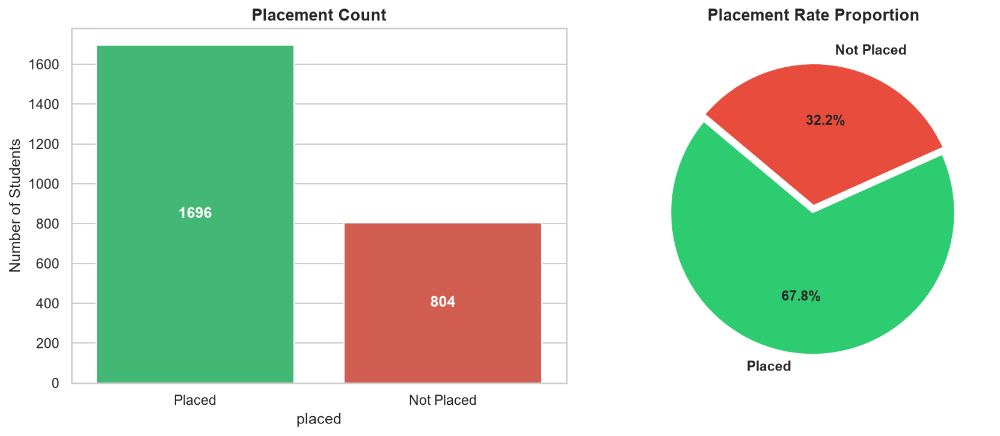
*Figure 1: Overall placement target distribution across the cohort.*

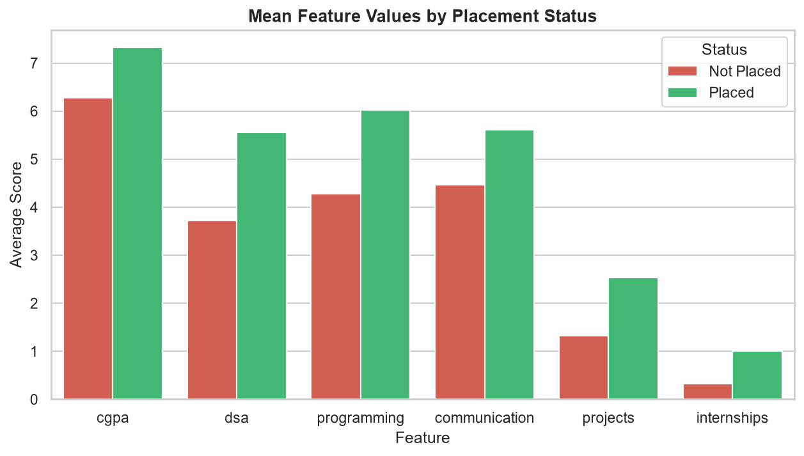
*Figure 2: Mean feature profiles comparing placed vs unplaced student cohorts.*

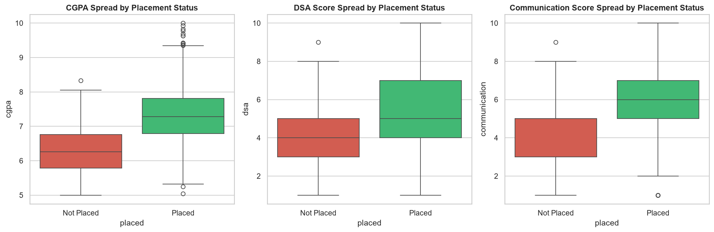
*Figure 3: Metric dispersion and quartile spreads for key predictors.*

### 2. Correlation Matrix & Feature Interdependencies

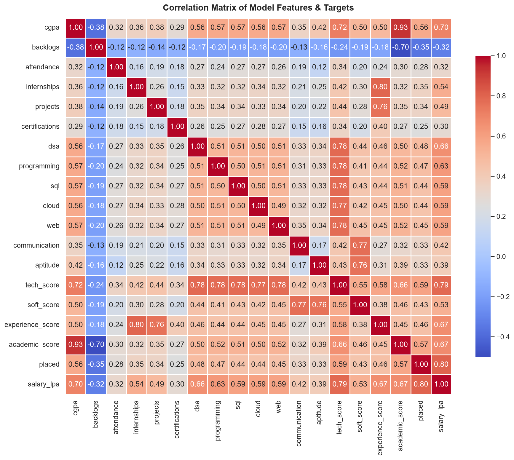
*Figure 4: Correlation heatmap illustrating relationships between skills, academics, experience, and placement outcomes.*

### 3. Engineered Domain Sub-Scores & Salary Distributions

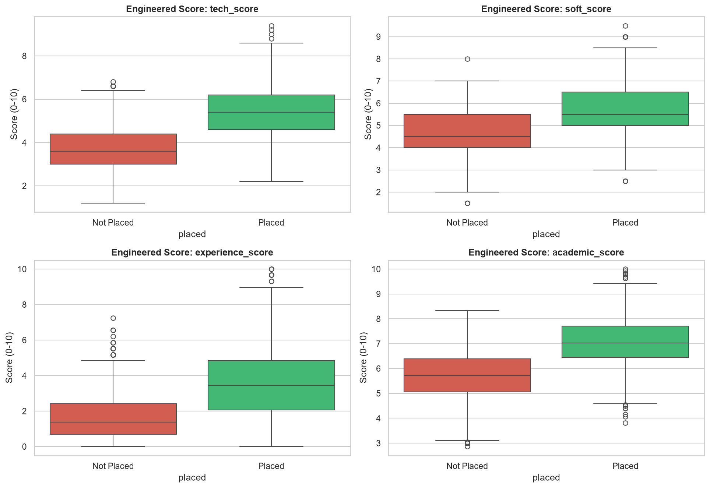
*Figure 5: Distributions of composite domain scores (Technical, Soft Skills, Practical Experience, and Academic Standing).*

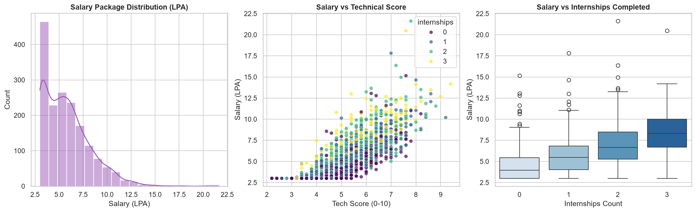
*Figure 6: Compensation package distributions, percentiles, and correlations conditional on placement offer.*

---

## Machine Learning Results & Diagnostic Plots

Real performance metrics recorded on the holdout test set (500 samples, 20%) from `models/metrics.json`:

### Placement Classifier Benchmark

| Model | CV ROC-AUC | CV Brier | Test Accuracy | Test Precision | Test Recall | Test F1 | Test ROC-AUC | Test Brier | Selected |
|---|---|---|---|---|---|---|---|---|---|
| Logistic Regression | 0.9134 | 0.1082 | 0.8520 | 0.8630 | 0.9292 | 0.8949 | 0.9127 | 0.1081 | Yes |
| Random Forest | 0.9099 | 0.1100 | 0.8580 | 0.8602 | 0.9440 | 0.9001 | 0.9068 | 0.1095 | No |
| Decision Tree | 0.8864 | 0.1222 | 0.8160 | 0.8459 | 0.8909 | 0.8678 | 0.8688 | 0.1272 | No |

Baseline Test Brier Score (Dummy Classifier): 0.2183.
Selection Reason: Logistic Regression was selected because its CV ROC-AUC (0.9134) was within the 0.005 tolerance of the highest score and achieved the lowest CV Brier score (0.1082), ensuring well-calibrated probabilities.

### Classifier Diagnostic Graphs

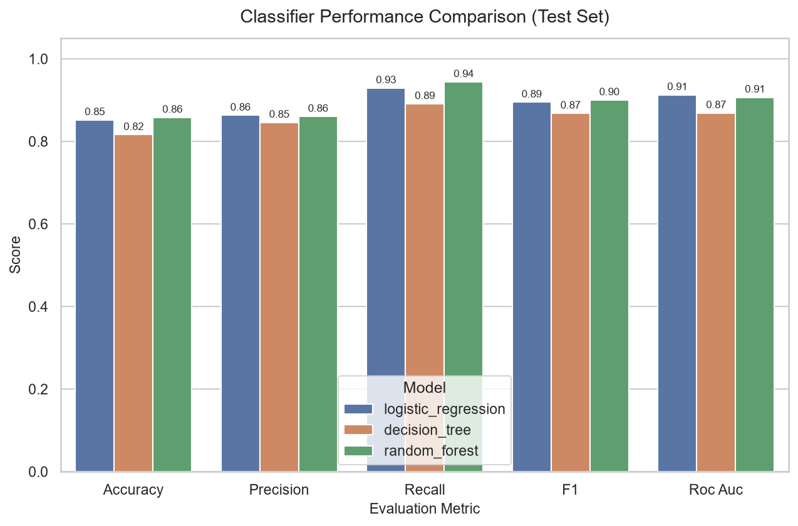
*Figure 7: Evaluation metrics comparison across candidate classifiers.*

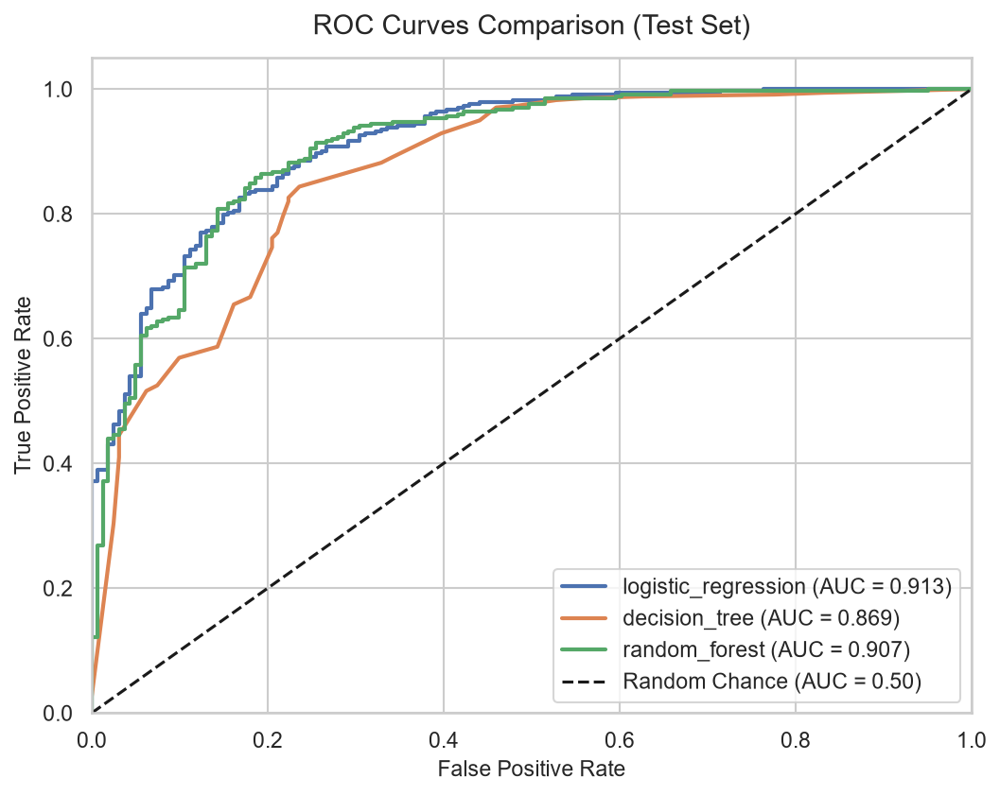
*Figure 8: Receiver Operating Characteristic (ROC) curves and holdout AUC scores.*

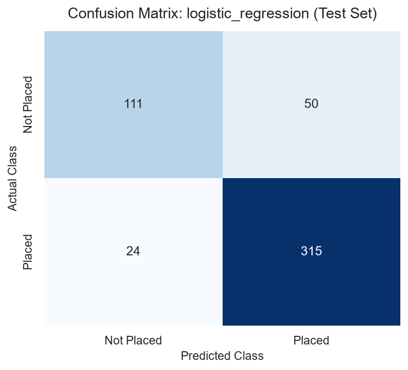
*Figure 9: Confusion matrix for selected Logistic Regression pipeline on holdout test set.*

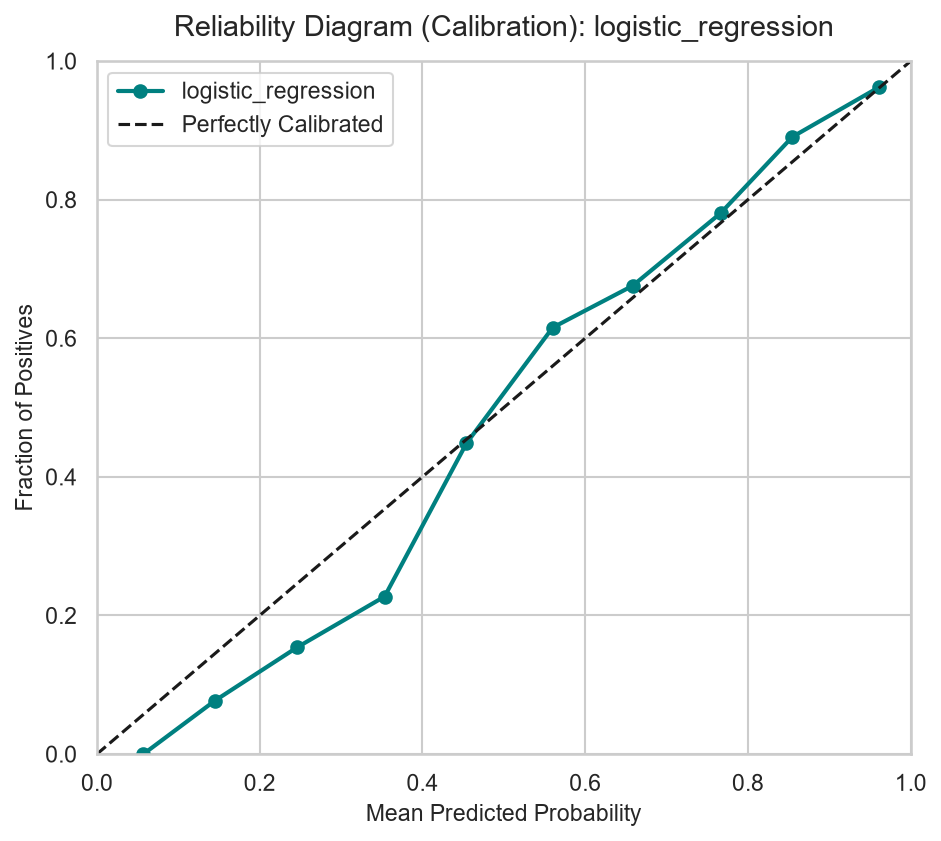
*Figure 10: Calibration curve showing close alignment between predicted probabilities and empirical placement frequencies.*

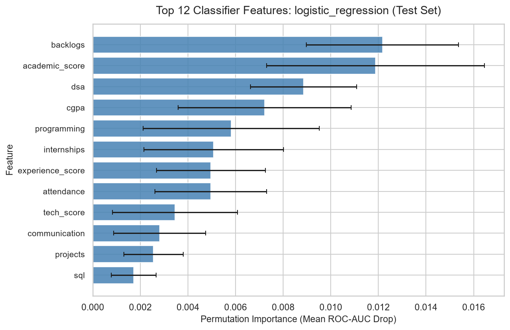
*Figure 11: Top 12 permutation feature importances for placement classification.*

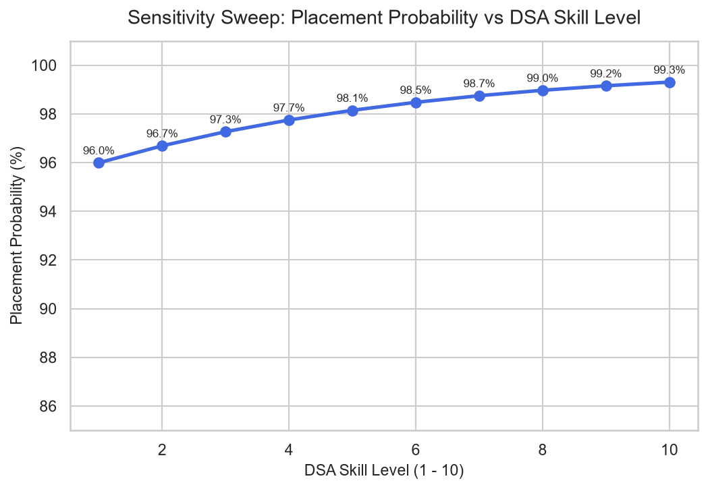
*Figure 12: Sensitivity sweep verifying monotonic increase in placement probability as DSA proficiency rises.*

---

### Salary Regressor Benchmark (Placed Candidates)

| Model | CV RMSE | CV MAE | Test MAE | Test RMSE | Test R2 | Selected |
|---|---|---|---|---|---|---|
| Linear Regression | 1.1766 | 0.8163 | 0.7850 | 1.1202 | 0.7781 | Yes |
| Random Forest Regressor | 1.2266 | 0.8250 | 0.7717 | 1.1423 | 0.7693 | No |

Baseline Test RMSE (Mean Regressor): 2.3786 LPA.
Selection Reason: Linear Regression achieved the lowest CV RMSE (1.1766) and CV MAE (0.8163).

### Regressor Diagnostic Graphs

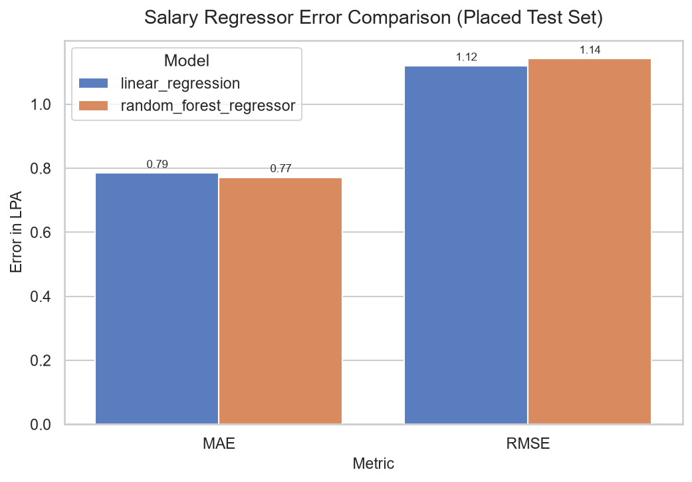
*Figure 13: Error metrics (MAE and RMSE) comparison across salary regressor candidates.*

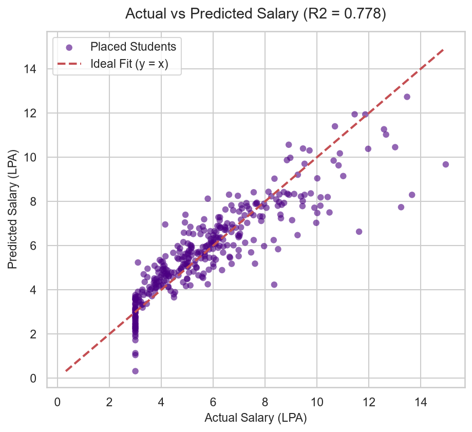
*Figure 14: Actual vs predicted salary package scatter plot for placed students.*

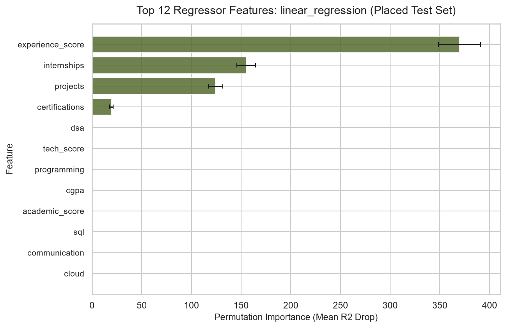
*Figure 15: Permutation feature importances for conditional salary regression.*

---

## Role Benchmarks & Skill Status Rules

### Career Profiles

1. Software Developer:
   - Primary Focus: DSA (8, wt 3.0), Programming (8, wt 3.0).
   - Secondary: SQL (6), Web (6), Communication (6), Aptitude (6), Cloud (5).
   - Profile Thresholds: Projects >= 3, Internships >= 1, Certifications >= 1, CGPA >= 7.0, Attendance >= 75%.
2. Data Analyst:
   - Primary Focus: SQL (8, wt 3.0), Communication (8, wt 3.0).
   - Secondary: Programming (6), Aptitude (7), Cloud (4), Web (4), DSA (5).
   - Profile Thresholds: Projects >= 2, Internships >= 1, Certifications >= 1, CGPA >= 6.5, Attendance >= 75%.
3. Data Scientist:
   - Primary Focus: Programming (8, wt 3.0), Aptitude (8, wt 3.0), SQL (7, wt 2.5).
   - Secondary: DSA (7), Cloud (6), Communication (7), Web (4).
   - Profile Thresholds: Projects >= 3, Internships >= 1, Certifications >= 2, CGPA >= 7.5, Attendance >= 75%.

### Status and Priority Formulas

- Gap Formula:
  `gap = benchmark - candidate_score`
- Status Classification:
  - GOOD: `gap <= 0` (score meets or exceeds benchmark)
  - MODERATE: `0 < gap <= 2` (within 2 points of benchmark)
  - WEAK: `gap > 2` (more than 2 points below benchmark)
- Priority Weighting:
  `priority_score = gap * role_importance`
  Deficiencies with higher priority scores are presented first in coaching recommendations.

### Skill Gap Preview

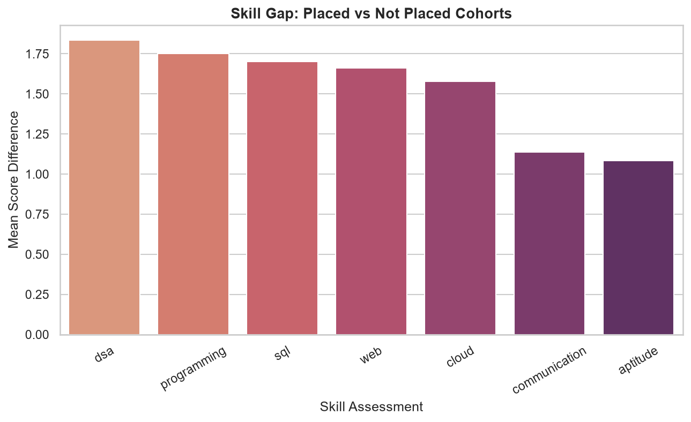
*Figure 16: Benchmark comparison radar chart and horizontal gap visualization.*

---

## Readiness Score & Risk Levels

### Overall Readiness Formula (0-100)

$$\text{Readiness} = 100 \times \left(0.50 \cdot P(\text{placed}) + 0.25 \cdot \frac{\text{tech\_score}}{10} + 0.15 \cdot \frac{\text{soft\_score}}{10} + 0.10 \cdot \frac{\text{experience\_score}}{10}\right)$$

### Placement Risk Thresholds

- LOW: Placement probability >= 75% (`P >= 0.75`)
- MEDIUM: Placement probability between 45% and 75% (`0.45 <= P < 0.75`)
- HIGH: Placement probability below 45% (`P < 0.45`)

---

## Export Dossiers & Reports

The application provides four export formats under the sidebar's "Export Dossier" section:

1. Formatted HTML Report (`placement_evaluation_report.html`):
   - Fully styled, standalone document ready for viewing in any browser or printing directly to PDF.
   - Includes executive KPI summary cards, candidate profile input table, skill gap analysis table with colored status badges, prioritized action item cards with expected gains, benchmark simulation outcomes, and institutional disclaimers.
2. Structured Detailed CSV (`placement_detailed_report.csv`):
   - Multi-section CSV report organized into Candidate Profile & Inputs, Projections & Outcomes, Skill Gap Breakdown, Prioritized Recommendations, Benchmark Simulation, and Regulatory Disclaimer.
3. Plain Markdown Dossier (`placement_readiness_report.md`):
   - Markdown formatted candidate diagnostic summary.
4. Single-Row Summary CSV (`placement_summary.csv`):
   - Flat tabular data record containing inputs, outcome metrics, and top recommendation labels.

---

## Backend Services API

The service layer (`backend/services.py`) is the single gateway between backend computation and the UI. It provides pure Python data structures without leaking Pandas or ML objects:

- `get_app_status() -> dict`: Checks readiness of required files (`placement_model.pkl`, `salary_model.pkl`, `metrics.json`, `clean_data.csv`) and returns fix commands.
- `get_ui_config() -> dict`: Provides application metadata, color palettes, risk thresholds, and tab titles.
- `get_input_spec() -> List[dict]`: Provides input specifications for all 13 features with groups, types, bounds, and help text.
- `get_example_students() -> Dict[str, Dict[str, float]]`: Supplies deep-copied benchmark profiles (Sample, Weak, Strong).
- `get_roles() -> List[dict]`: Lists available role profiles with names and descriptions.
- `get_full_report(student, role=None) -> dict`: Complete candidate diagnostic payload covering predictions, radar coordinates, skill gaps, impact analysis, recommendations, benchmark simulations, peer percentiles, and role comparisons.
- `run_what_if(student, changes, role=None) -> dict`: Computes counterfactual simulations for modified student attributes.
- `get_dataset_insights() -> dict`: Computes cached cohort distributions, placement rates, and salary percentiles.
- `get_model_insights() -> dict`: Returns cross-validation summaries, holdout metrics, permutation importances, and figure paths.
- `build_report_html(report) -> str`: Formats an ASCII standalone styled HTML diagnostic dossier with print-to-PDF support.
- `build_detailed_report_csv(report) -> str`: Produces a structured multi-section CSV report.
- `build_report_markdown(report) -> str`: Formats a comprehensive ASCII Markdown diagnostic summary.
- `build_report_csv(report) -> str`: Produces a single-row CSV export of inputs, outputs, and recommendations.
- `clear_caches() -> None`: Clears in-memory dataset and insight caches.

---

## Verification and Testing

To verify pipeline integrity, run testing and evaluation commands from the repository root:

```bash
# Test inference and metrics
python -m backend.predict

# Test skill gap analysis
python -m backend.skill_gap

# Test recommendation engine
python -m backend.recommender
```

---

## Methodological Limitations

- Synthetic Dataset: Data is generated using latent effort distributions and empirical hiring heuristics. While calibrated to real-world dynamics, predictions serve as advisory guidance, not career guarantees.
- Conditional Salary: The salary prediction model is trained exclusively on placed candidates (`placed == 1`) and represents the expected annual package conditional upon securing a placement offer.
- Self-Assessed Ratings: Technical and soft skill inputs rely on candidate self-ratings (1-10). In practical deployments, objective coding test scores and assessment results should supplement self-evaluations.

---

## Future Enhancements

- Real Institutional Data: Fine-tune model parameters and benchmarks on historical multi-year university placement records.
- Database Integration: Store assessment histories and cohort analytics in PostgreSQL or MongoDB.
- Expanded Roles: Introduce specialized career tracks such as DevOps Engineer, Machine Learning Engineer, and Product Analyst.
- PDF Diagnostic Export: Provide formal PDF generation for student portfolios and placement advisory cells.
- Enterprise Deployment: Containerize application with Docker and deploy to cloud platforms with authentication.
